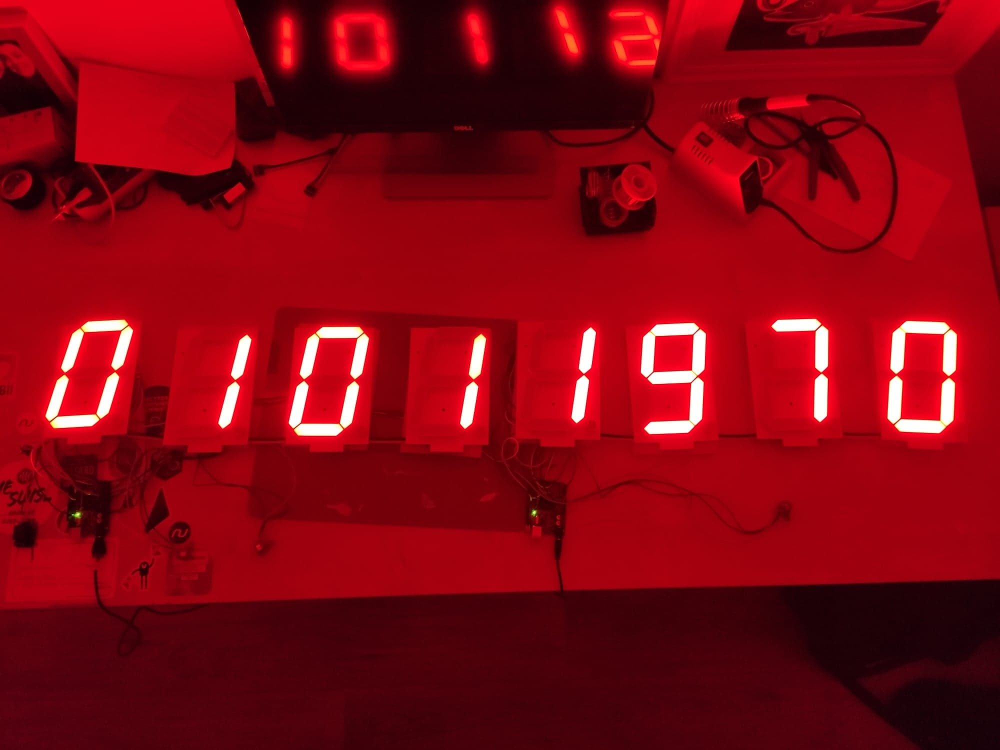
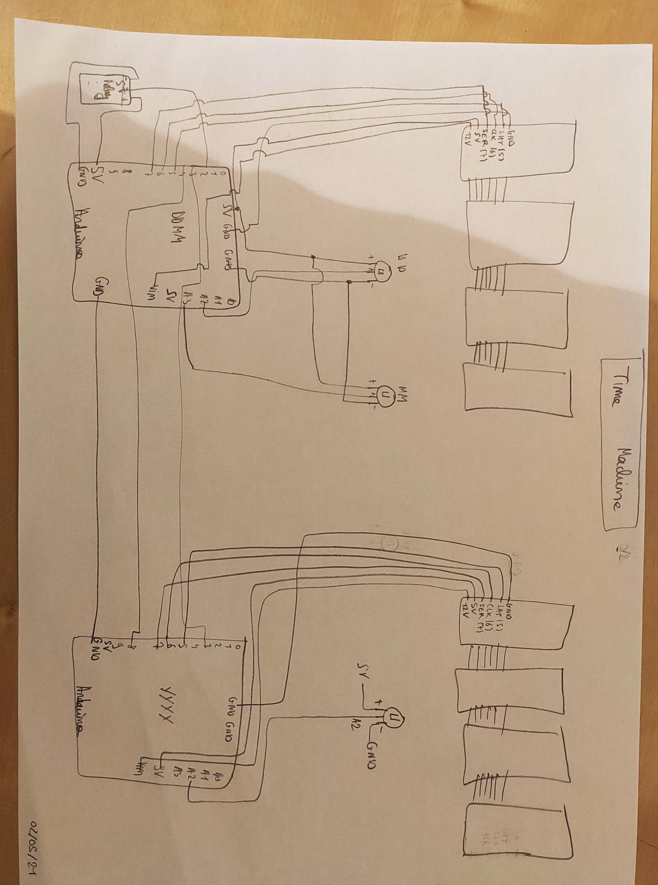

# time-machine
## Time machine arduino for escape room

## Firmware

- **potar-to-digits-ddmm.ino**

This program read an analog value from two potentiometers and map them to dd/mm date.
Then it display it to 4 large digits from sparkfun.
A second arduino is use for the year. It set SUCCESS_YEAR_PIN to LOW if this is the right year.
If full date ddmmyyyy is right, then it activates an output (relay) and display random numbers on digits.

- **potar-to-year.ino**

This program read an analog value from one potentiometer and map it to year.
Then it display it to 4 large digits from sparkfun.
A second arduino is use for the date and month. It set SUCCESS_DDMM_PIN to LOW if this is the right day and month.
If full date ddmmyyyy is right, then it display random numbers on digits.

## Hardware

Here is the quick and dirty schematic:

